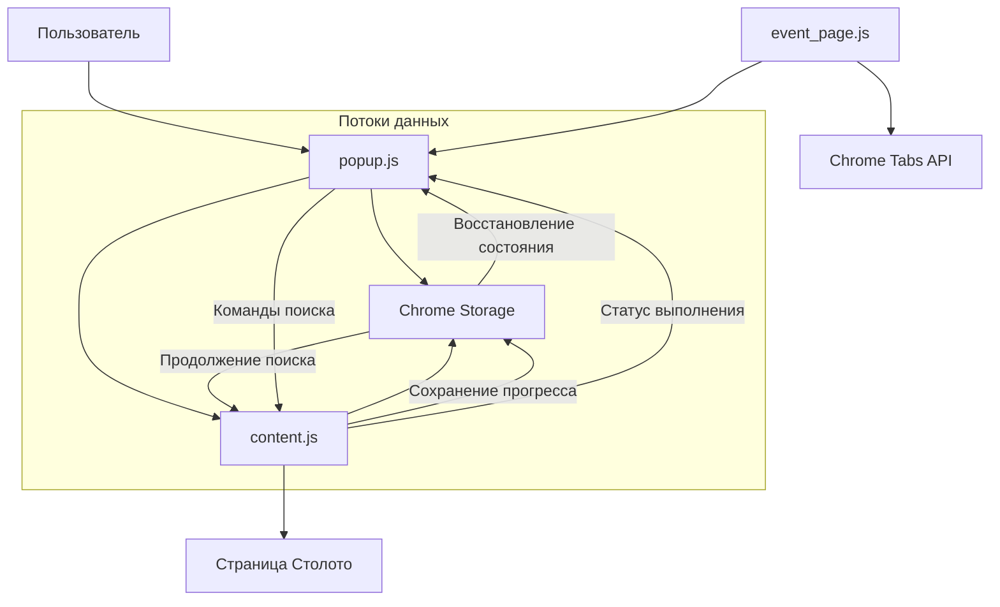

# Паттерны взаимодействия компонентов

## Введение

Расширение "Столото Автокликер" использует сложную систему взаимодействия между компонентами для обеспечения надежной работы. Основные потоки коммуникации включают передачу сообщений между popup и content script, синхронизацию состояния через Chrome Storage, и обработку событий через service worker.

## Схема взаимодействия компонентов



## Типы взаимодействий

### 1. Popup ↔ Content Script

Основной канал коммуникации для передачи команд и получения статуса выполнения.

#### Отправка команд от Popup к Content Script

**Структура сообщения**:
```javascript
chrome.tabs.sendMessage(activeTab.id, {
    action: 'clickNumbers',
    numbers: [1, 5, 12, 23, 34],
    excludeNumbers: [7, 14, 21],
    mode: 'half',
    isPurchaseMode: true,
    ticketsToBuy: 3
}, (response) => {
    // Обработка ответа
    if (response && response.status === 'error') {
        alert(response.message);
    }
});
```

**Типы команд**:
- `clickNumbers` - запуск поиска билетов
- `stopSearch` - остановка текущего поиска
- `checkUserLogin` - проверка авторизации пользователя
- `checkUserBalance` - проверка баланса пользователя

#### Ответы от Content Script к Popup

**Структура ответа**:
```javascript
// Успешный ответ
{
    status: 'success',
    data: { /* дополнительные данные */ }
}

// Ответ с ошибкой
{
    status: 'error',
    message: 'Описание ошибки'
}

// Ответ проверки авторизации
{
    isLoggedIn: true,
    timestamp: Date.now()
}

// Ответ проверки баланса
{
    balance: 1500,
    hasEnoughFunds: true
}
```

#### Обработка ошибок коммуникации

```javascript
chrome.tabs.sendMessage(tab.id, message, (response) => {
    if (chrome.runtime.lastError) {
        console.error('Ошибка коммуникации:', chrome.runtime.lastError.message);
        // Обработка ошибки - показ уведомления пользователю
        alert('Ошибка: убедитесь, что вы находитесь на странице Столото');
        return;
    }
    
    // Обработка успешного ответа
    if (response && response.status === 'success') {
        // Логика успешного выполнения
    }
});
```

### 2. Синхронизация состояния через Chrome Storage

Chrome Storage API используется для персистентного хранения данных между сессиями и компонентами.

#### Схема данных в Storage

```javascript
// Последний поиск
lastSearch: {
    numbers: [1, 5, 12, 23, 34],
    excludeNumbers: [7, 14, 21],
    mode: 'half',
    isPurchaseMode: true,
    ticketsToBuy: 3,
    timestamp: 1640995200000
}

// Состояние покупки
purchaseState: {
    isPurchaseMode: true,
    totalTicketsToBuy: 5,
    ticketsPurchased: 2,
    purchaseSearchNumbers: [1, 5, 12, 23, 34],
    purchaseExcludeNumbers: [7, 14, 21],
    purchaseSearchMode: 'half',
    purchaseTicketsChecked: 150,
    purchaseStartTime: 1640995200000,
    timestamp: 1640995800000
}

// Статус авторизации
authStatus: {
    isLoggedIn: true,
    timestamp: 1640995200000
}
```

#### Сохранение данных

```javascript
// В popup.js - сохранение параметров поиска
async function saveSearchParams(numbers, excludeNumbers, mode, isPurchaseMode, ticketsToBuy) {
    await chrome.storage.local.set({
        lastSearch: {
            numbers: numbers,
            excludeNumbers: excludeNumbers,
            mode: mode,
            isPurchaseMode: isPurchaseMode,
            ticketsToBuy: ticketsToBuy,
            timestamp: Date.now()
        }
    });
}

// В content.js - сохранение состояния покупки
async function savePurchaseState() {
    await chrome.storage.local.set({
        purchaseState: {
            isPurchaseMode,
            totalTicketsToBuy,
            ticketsPurchased,
            purchaseSearchNumbers,
            purchaseExcludeNumbers,
            purchaseSearchMode,
            purchaseTicketsChecked,
            purchaseStartTime,
            timestamp: Date.now()
        }
    });
}
```

#### Загрузка данных

```javascript
// В popup.js - восстановление последних параметров
async function loadLastSearchParams() {
    const data = await chrome.storage.local.get('lastSearch');
    if (data.lastSearch) {
        numbersInput.value = data.lastSearch.numbers.join(', ');
        excludeNumbersInput.value = data.lastSearch.excludeNumbers.join(', ');
        searchMode.value = data.lastSearch.mode;
        
        // Восстановление режима покупки только для авторизованных пользователей
        const currentAuthStatus = await checkAuthFromStorage();
        if (data.lastSearch.isPurchaseMode && currentAuthStatus) {
            testPurchaseModeCheckbox.checked = true;
            purchaseOptionsContainer.style.display = 'block';
            ticketsToBuyInput.value = data.lastSearch.ticketsToBuy || 1;
        }
    }
}

// В content.js - восстановление состояния покупки
async function loadPurchaseState() {
    const data = await chrome.storage.local.get('purchaseState');
    if (data.purchaseState) {
        isPurchaseMode = data.purchaseState.isPurchaseMode;
        totalTicketsToBuy = data.purchaseState.totalTicketsToBuy;
        ticketsPurchased = data.purchaseState.ticketsPurchased;
        // ... восстановление остальных параметров
        
        // Продолжение поиска, если покупка не завершена
        if (isPurchaseMode && ticketsPurchased < totalTicketsToBuy) {
            setTimeout(() => {
                clearSelection().then(() => {
                    clickNumbers(purchaseSearchNumbers, purchaseSearchMode, purchaseExcludeNumbers);
                });
            }, 1500);
        }
    }
}
```

### 3. Service Worker ↔ Tabs Management

Service Worker управляет навигацией и активацией расширения.

#### Обработка кликов по иконке

```javascript
chrome.action.onClicked.addListener(async (tab) => {
    const workPageUrl = 'https://www.stoloto.ru/ruslotto/game?viewType=favorite';
    
    if (tab.url === workPageUrl) {
        // Пользователь уже на рабочей странице - открываем popup
        await chrome.action.setPopup({ popup: 'popup.html' });
        await chrome.action.openPopup();
    } else {
        // Перенаправляем на рабочую страницу
        await chrome.tabs.create({ url: workPageUrl });
    }
    
    // Сбрасываем popup для следующего клика
    await chrome.action.setPopup({ popup: '' });
});
```

## Обработка событий

### 1. Инициализация компонентов

#### Popup инициализация

```javascript
document.addEventListener('DOMContentLoaded', async () => {
    console.log('Инициализация popup...');
    
    // 1. Проверка авторизации
    await checkAuthFromStorage();
    
    // 2. Обновление UI
    updateAuthDependentUI();
    
    // 3. Загрузка последних параметров
    await loadLastSearchParams();
    
    // 4. Дополнительные проверки с задержкой
    setTimeout(async () => {
        await checkActiveTabAuth();
        updateAuthDependentUI();
    }, 500);
});
```

#### Content Script инициализация

```javascript
// Автоматическая загрузка состояния при загрузке страницы
loadPurchaseState();

// Сохранение статуса авторизации
saveAuthStatus();

// Регистрация обработчика сообщений
chrome.runtime.onMessage.addListener((request, sender, sendResponse) => {
    console.log('Получено сообщение:', request);
    
    switch(request.action) {
        case 'clickNumbers':
            handleClickNumbers(request, sendResponse);
            break;
        case 'stopSearch':
            handleStopSearch(request, sendResponse);
            break;
        case 'checkUserLogin':
            handleCheckUserLogin(request, sendResponse);
            break;
        case 'checkUserBalance':
            handleCheckUserBalance(request, sendResponse);
            break;
    }
    
    return true; // Асинхронный ответ
});
```

### 2. Механизмы синхронизации состояния

#### Проверка авторизации

```javascript
// Многоуровневая проверка авторизации
async function checkAuthFromStorage() {
    try {
        const data = await chrome.storage.local.get('authStatus');
        if (data.authStatus) {
            // Проверка актуальности данных (не старше 10 секунд)
            const isRecent = (Date.now() - data.authStatus.timestamp) < 10 * 1000;
            
            if (isRecent) {
                isUserAuthenticated = data.authStatus.isLoggedIn;
                return isUserAuthenticated;
            }
        }
        
        // Если данных нет или они устарели - проверяем через активную вкладку
        return await checkActiveTabAuth();
    } catch (error) {
        console.error('Ошибка при проверке авторизации:', error);
        return false;
    }
}

// Проверка через активную вкладку
async function checkActiveTabAuth() {
    const tabs = await chrome.tabs.query({ active: true, currentWindow: true });
    
    if (!tabs || tabs.length === 0) {
        return false;
    }
    
    return new Promise((resolve) => {
        chrome.tabs.sendMessage(tabs[0].id, { action: 'checkUserLogin' }, (response) => {
            if (chrome.runtime.lastError || !response) {
                resolve(false);
                return;
            }
            
            if (response.isLoggedIn !== undefined) {
                isUserAuthenticated = response.isLoggedIn;
                
                // Сохраняем результат в storage
                chrome.storage.local.set({
                    authStatus: {
                        isLoggedIn: isUserAuthenticated,
                        timestamp: Date.now()
                    }
                });
                
                resolve(isUserAuthenticated);
            } else {
                resolve(false);
            }
        });
        
        // Таймаут на случай отсутствия ответа
        setTimeout(() => resolve(false), 1000);
    });
}
```

#### Обновление UI в реальном времени

```javascript
// Обновление статуса поиска на странице
function updateStatusBlock(numbers, excludeNumbers, mode) {
    let statusEl = document.getElementById('rusloto-status');
    if (!statusEl) {
        statusEl = document.createElement('div');
        statusEl.id = 'rusloto-status';
        statusEl.style.cssText = STATUS_STYLES;
        document.body.insertBefore(statusEl, document.body.firstChild);
    }

    // Формирование текста статуса
    const numbersText = numbers.join(', ');
    const excludeText = excludeNumbers.length > 0 ? ` за исключением ${excludeNumbers.join(', ')}` : '';
    const ticketsText = ticketsChecked > 0 ? `Проверено билетов: ${ticketsChecked}` : '';
    const timeText = searchStartTime ? `Время поиска: ${formatSearchTime()}` : '';
    
    let statusText = `Ищем числа ${numbersText}${excludeText} ${modeText}`;
    
    if (ticketsText || timeText) {
        statusText += `\n${ticketsText}${ticketsText && timeText ? '. ' : ''}${timeText}`;
    }
    
    // Информация о режиме покупки
    if (isPurchaseMode) {
        const purchaseText = `Автоматическая покупка. Куплено билетов: ${ticketsPurchased} из ${totalTicketsToBuy}`;
        statusText += `\n${purchaseText}`;
        
        // Изменение цвета при завершении
        if (ticketsPurchased >= totalTicketsToBuy) {
            statusEl.style.background = '#28a745'; // зеленый
        }
    }
    
    statusEl.textContent = statusText;
}
```

## Процедуры восстановления соединения

### 1. Обработка потери соединения

```javascript
// Обработка ошибок при отправке сообщений
function sendMessageWithRetry(tabId, message, maxRetries = 3) {
    return new Promise((resolve, reject) => {
        let attempts = 0;
        
        function attemptSend() {
            attempts++;
            
            chrome.tabs.sendMessage(tabId, message, (response) => {
                if (chrome.runtime.lastError) {
                    if (attempts < maxRetries) {
                        console.log(`Попытка ${attempts} неудачна, повторяем...`);
                        setTimeout(attemptSend, 1000 * attempts); // Экспоненциальная задержка
                    } else {
                        reject(new Error(chrome.runtime.lastError.message));
                    }
                } else {
                    resolve(response);
                }
            });
        }
        
        attemptSend();
    });
}
```

### 2. Восстановление после перезагрузки страницы

```javascript
// В content.js - автоматическое восстановление состояния
window.addEventListener('load', async () => {
    console.log('Страница загружена, проверяем состояние...');
    
    // Загружаем сохраненное состояние покупки
    await loadPurchaseState();
    
    // Если есть незавершенная покупка, продолжаем
    if (isPurchaseMode && ticketsPurchased < totalTicketsToBuy) {
        console.log('Обнаружена незавершенная покупка, продолжаем...');
        
        // Восстанавливаем статус блок
        updateStatusBlock(purchaseSearchNumbers, purchaseExcludeNumbers, purchaseSearchMode);
        
        // Продолжаем поиск с задержкой для полной загрузки страницы
        setTimeout(() => {
            clearSelection().then(() => {
                clickNumbers(purchaseSearchNumbers, purchaseSearchMode, purchaseExcludeNumbers);
            });
        }, 1500);
    }
});
```

### 3. Обработка таймаутов

```javascript
// Установка таймаутов для предотвращения зависания
function executeWithTimeout(operation, timeout = 5000) {
    return Promise.race([
        operation,
        new Promise((_, reject) => 
            setTimeout(() => reject(new Error('Операция превысила таймаут')), timeout)
        )
    ]);
}

// Использование в проверке баланса
async function checkUserBalance(ticketsToBuy) {
    try {
        const result = await executeWithTimeout(
            checkBalanceOperation(ticketsToBuy),
            1500
        );
        return result;
    } catch (error) {
        console.error('Таймаут при проверке баланса:', error);
        return { hasEnoughFunds: false, balance: 0 };
    }
}
```

## Разрешение конфликтов

### 1. Конфликты состояния

```javascript
// Проверка консистентности данных
async function validateStateConsistency() {
    const [lastSearch, purchaseState, authStatus] = await Promise.all([
        chrome.storage.local.get('lastSearch'),
        chrome.storage.local.get('purchaseState'),
        chrome.storage.local.get('authStatus')
    ]);
    
    // Проверка соответствия режима покупки и авторизации
    if (purchaseState.purchaseState?.isPurchaseMode && 
        !authStatus.authStatus?.isLoggedIn) {
        console.warn('Конфликт: режим покупки активен, но пользователь не авторизован');
        await resetPurchaseState();
    }
    
    // Проверка актуальности временных меток
    const now = Date.now();
    if (authStatus.authStatus && (now - authStatus.authStatus.timestamp) > 60000) {
        console.warn('Данные авторизации устарели, требуется обновление');
        await checkActiveTabAuth();
    }
}
```

### 2. Синхронизация между компонентами

```javascript
// Централизованное обновление состояния авторизации
async function updateAuthStatus(isLoggedIn) {
    const authData = {
        isLoggedIn: isLoggedIn,
        timestamp: Date.now()
    };
    
    // Сохраняем в storage
    await chrome.storage.local.set({ authStatus: authData });
    
    // Обновляем локальную переменную
    isUserAuthenticated = isLoggedIn;
    
    // Уведомляем другие компоненты через storage events
    chrome.storage.onChanged.addListener((changes, namespace) => {
        if (namespace === 'local' && changes.authStatus) {
            console.log('Статус авторизации обновлен:', changes.authStatus.newValue);
            updateAuthDependentUI();
        }
    });
}
```

## Лучшие практики взаимодействия

### 1. Асинхронная обработка

- Использование async/await для всех операций с Chrome APIs
- Обработка ошибок через try/catch блоки
- Установка таймаутов для предотвращения зависания

### 2. Валидация данных

- Проверка существования объектов перед обращением к их свойствам
- Валидация типов данных при получении сообщений
- Проверка актуальности временных меток

### 3. Graceful degradation

- Продолжение работы при недоступности отдельных компонентов
- Предоставление альтернативных путей выполнения операций
- Информирование пользователя о проблемах через UI