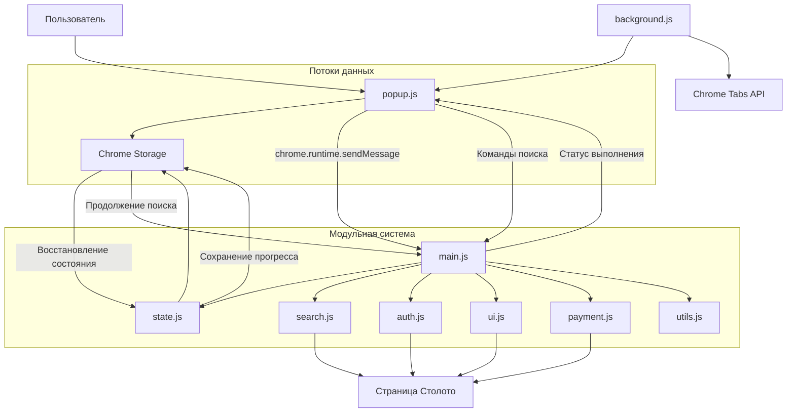

# Взаимодействие компонентов

## Введение

Расширение "Столото Автокликер" использует современную модульную архитектуру с четко определенными паттернами взаимодействия между компонентами. Основные потоки коммуникации включают передачу сообщений между popup и content script через main.js, синхронизацию состояния через Chrome Storage API, и координацию работы модулей.

## Схема взаимодействия компонентов



## Типы взаимодействий

### 1. Popup ↔ Content Script через main.js

Основной канал коммуникации для передачи команд и получения статуса выполнения. Все сообщения обрабатываются через `setupMessageListener()` в main.js.

#### Отправка команд от Popup к main.js

**Структура сообщения**:
```javascript
chrome.tabs.sendMessage(activeTab.id, {
    action: 'clickNumbers',
    numbers: [1, 5, 12, 23, 34],
    excludeNumbers: [7, 14, 21],
    mode: 'half',
    isPurchaseMode: true,
    ticketsToBuy: 3
}, (response) => {
    // Обработка ответа
    if (response && response.status === 'error') {
        alert(response.message);
    }
});
```

**Типы команд**:
- `clickNumbers` - запуск поиска билетов
- `stopSearch` - остановка текущего поиска
- `checkUserLogin` - проверка авторизации пользователя
- `checkUserBalance` - проверка баланса пользователя

#### Обработка сообщений в main.js через setupMessageListener

**Обработчик сообщений**:
```javascript
function setupMessageListener() {
    chrome.runtime.onMessage.addListener((request, sender, sendResponse) => {
        const state = window.stolotoState;
        
        console.log('Получено сообщение:', request);
        
        if (request.action === 'clickNumbers') {
            // Проверка авторизации для режима покупки
            const needsAuth = request.isPurchaseMode;
            
            if (needsAuth && !window.stolotoAuth.isUserLoggedIn()) {
                window.stolotoUI.showAuthWarning();
                state.saveAuthStatus();
                sendResponse({
                    status: 'error', 
                    message: 'Для использования режима автоматической покупки необходимо авторизоваться на сайте Столото'
                });
                return true;
            }
            
            // Установка параметров в state.js
            state.isPurchaseMode = request.isPurchaseMode || false;
            state.totalTicketsToBuy = request.ticketsToBuy || 0;
            state.purchaseSearchNumbers = request.numbers;
            state.purchaseExcludeNumbers = request.excludeNumbers || [];
            state.purchaseSearchMode = request.mode;
            
            // Запуск поиска через search.js
            window.stolotoSearch.clearSelection().then(() => {
                clickNumbers(request.numbers, request.mode, request.excludeNumbers || []);
                sendResponse({status: 'success'});
            });
            return true;
            
        } else if (request.action === 'checkUserLogin') {
            // Проверка через auth.js
            const isLoggedIn = window.stolotoAuth.isUserLoggedIn();
            state.saveAuthStatus();
            sendResponse({ isLoggedIn: isLoggedIn });
            return true;
            
        } else if (request.action === 'checkUserBalance') {
            // Проверка баланса через auth.js
            const userBalance = window.stolotoAuth.getUserBalance();
            const hasEnough = window.stolotoAuth.hasEnoughFunds(request.ticketsToBuy || 1);
            
            sendResponse({
                balance: userBalance,
                hasEnoughFunds: hasEnough,
                requiredAmount: (request.ticketsToBuy || 1) * 150
            });
            return true;
        }
    });
}
```

**Структуры ответов**:
```javascript
// Успешный запуск поиска
{
    status: 'success'
}

// Ошибка авторизации
{
    status: 'error',
    message: 'Для использования режима автоматической покупки необходимо авторизоваться на сайте Столото'
}

// Ответ проверки авторизации
{
    isLoggedIn: true
}

// Ответ проверки баланса
{
    balance: 1500,
    hasEnoughFunds: true,
    requiredAmount: 450
}
```

#### Обработка ошибок коммуникации

```javascript
chrome.tabs.sendMessage(tab.id, message, (response) => {
    if (chrome.runtime.lastError) {
        console.error('Ошибка коммуникации:', chrome.runtime.lastError.message);
        // Обработка ошибки - показ уведомления пользователю
        alert('Ошибка: убедитесь, что вы находитесь на странице Столото');
        return;
    }
    
    // Обработка успешного ответа
    if (response && response.status === 'success') {
        // Логика успешного выполнения
    }
});
```

### 2. Синхронизация состояния через Chrome Storage API

Chrome Storage API используется для персистентного хранения данных между сессиями и компонентами. Управление состоянием централизовано в модуле state.js.

#### Схема данных в Storage

```javascript
// Последний поиск (управляется popup.js)
lastSearch: {
    numbers: [1, 5, 12, 23, 34],
    excludeNumbers: [7, 14, 21],
    mode: 'half',
    isPurchaseMode: true,
    ticketsToBuy: 3,
    timestamp: 1640995200000
}

// Состояние покупки (управляется state.js)
purchaseState: {
    isPurchaseMode: true,
    totalTicketsToBuy: 5,
    ticketsPurchased: 2,
    purchaseSearchNumbers: [1, 5, 12, 23, 34],
    purchaseExcludeNumbers: [7, 14, 21],
    purchaseSearchMode: 'half',
    purchaseTicketsChecked: 150,
    purchaseStartTime: 1640995200000,
    timestamp: 1640995800000
}

// Статус авторизации (управляется state.js)
authStatus: {
    isLoggedIn: true,
    timestamp: 1640995200000
}
```

#### Сохранение данных

```javascript
// В popup.js - сохранение параметров поиска
async function saveSearchParams(numbers, excludeNumbers, mode, isPurchaseMode, ticketsToBuy) {
    await chrome.storage.local.set({
        lastSearch: {
            numbers: numbers,
            excludeNumbers: excludeNumbers,
            mode: mode,
            isPurchaseMode: isPurchaseMode,
            ticketsToBuy: ticketsToBuy,
            timestamp: Date.now()
        }
    });
}

// В state.js - сохранение состояния покупки
async function savePurchaseState() {
    const state = window.stolotoState;
    await chrome.storage.local.set({
        purchaseState: {
            isPurchaseMode: state.isPurchaseMode,
            totalTicketsToBuy: state.totalTicketsToBuy,
            ticketsPurchased: state.ticketsPurchased,
            purchaseSearchNumbers: state.purchaseSearchNumbers,
            purchaseExcludeNumbers: state.purchaseExcludeNumbers,
            purchaseSearchMode: state.purchaseSearchMode,
            purchaseTicketsChecked: state.purchaseTicketsChecked,
            purchaseStartTime: state.purchaseStartTime,
            timestamp: Date.now()
        }
    });
    console.log('Состояние покупки сохранено:', {
        ticketsPurchased: state.ticketsPurchased,
        totalTicketsToBuy: state.totalTicketsToBuy
    });
}

// В state.js - сохранение статуса авторизации
async function saveAuthStatus() {
    const isLoggedIn = window.stolotoAuth.isUserLoggedIn();
    
    await chrome.storage.local.set({
        authStatus: {
            isLoggedIn,
            timestamp: Date.now()
        }
    });
}
```

#### Загрузка данных

```javascript
// В popup.js - восстановление последних параметров
async function loadLastSearchParams() {
    const data = await chrome.storage.local.get('lastSearch');
    if (data.lastSearch) {
        numbersInput.value = data.lastSearch.numbers.join(', ');
        excludeNumbersInput.value = data.lastSearch.excludeNumbers.join(', ');
        searchMode.value = data.lastSearch.mode;
        
        // Восстановление режима покупки только для авторизованных пользователей
        const currentAuthStatus = await checkAuthFromStorage();
        if (data.lastSearch.isPurchaseMode && currentAuthStatus) {
            testPurchaseModeCheckbox.checked = true;
            purchaseOptionsContainer.style.display = 'block';
            ticketsToBuyInput.value = data.lastSearch.ticketsToBuy || 1;
        }
    }
}

// В state.js - восстановление состояния покупки
async function loadPurchaseState() {
    try {
        const data = await chrome.storage.local.get('purchaseState');
        if (data.purchaseState) {
            const state = window.stolotoState;
            const savedState = data.purchaseState;
            
            // Восстановление всех параметров состояния
            state.isPurchaseMode = savedState.isPurchaseMode;
            state.totalTicketsToBuy = savedState.totalTicketsToBuy;
            state.ticketsPurchased = savedState.ticketsPurchased;
            state.purchaseSearchNumbers = savedState.purchaseSearchNumbers;
            state.purchaseExcludeNumbers = savedState.purchaseExcludeNumbers;
            state.purchaseSearchMode = savedState.purchaseSearchMode;
            state.purchaseTicketsChecked = savedState.purchaseTicketsChecked || 0;
            state.purchaseStartTime = savedState.purchaseStartTime || null;
            
            // Проверка авторизации перед продолжением
            if (state.isPurchaseMode && !window.stolotoAuth.isUserLoggedIn()) {
                console.log('❌ Пользователь вышел из аккаунта, отменяем режим покупки');
                window.stolotoUI.showAuthWarning();
                await resetPurchaseState();
                return;
            }
            
            // Продолжение покупки, если она не завершена
            if (state.isPurchaseMode && state.ticketsPurchased < state.totalTicketsToBuy) {
                console.log('Продолжаем покупку билетов, осталось купить:', 
                           state.totalTicketsToBuy - state.ticketsPurchased);
                
                // Восстановление счетчиков и UI
                state.ticketsChecked = state.purchaseTicketsChecked;
                state.searchStartTime = state.purchaseStartTime;
                
                window.stolotoUI.updateStatusBlock(
                    state.purchaseSearchNumbers, 
                    state.purchaseExcludeNumbers, 
                    state.purchaseSearchMode
                );
                
                // Запуск поиска с задержкой
                setTimeout(() => {
                    window.stolotoSearch.clearSelection().then(() => {
                        window.stolotoMain.clickNumbers(
                            state.purchaseSearchNumbers, 
                            state.purchaseSearchMode, 
                            state.purchaseExcludeNumbers
                        );
                    });
                }, 1500);
            }
        }
    } catch (error) {
        console.error('Ошибка при загрузке состояния покупки:', error);
    }
}
```

### 3. Background Service Worker ↔ Tabs Management

Background Service Worker управляет навигацией и активацией расширения в соответствии с требованиями Manifest V3.

#### Обработка кликов по иконке в background.js

```javascript
chrome.action.onClicked.addListener(async (tab) => {
    // URL рабочей страницы приложения
    const workPageUrl = 'https://www.stoloto.ru/ruslotto/game?viewType=favorite';
    
    // Если текущая вкладка - рабочая страница приложения
    if (tab.url === workPageUrl) {
        // Открываем popup
        await chrome.action.setPopup({ popup: 'popup.html' });
        // Имитируем повторный клик, чтобы открыть popup
        await chrome.action.openPopup();
    } else {
        // Если текущая вкладка не рабочая, открываем новую
        await chrome.tabs.create({ url: workPageUrl });
    }
    
    // Сбрасываем popup, чтобы следующий клик снова прошёл через этот обработчик
    await chrome.action.setPopup({ popup: '' });
});
```

**Особенности Service Worker**:
- Событийная модель активации
- Ограниченное время жизни
- Отсутствие доступа к DOM
- Работа только с Chrome APIs

## Обработка событий

### 1. Инициализация компонентов

#### Popup инициализация

```javascript
document.addEventListener('DOMContentLoaded', async () => {
    console.log('Инициализация popup...');
    
    // 1. Проверка авторизации
    await checkAuthFromStorage();
    
    // 2. Обновление UI
    updateAuthDependentUI();
    
    // 3. Загрузка последних параметров
    await loadLastSearchParams();
    
    // 4. Дополнительные проверки с задержкой
    setTimeout(async () => {
        await checkActiveTabAuth();
        updateAuthDependentUI();
    }, 500);
});
```

#### Content Script инициализация

```javascript
// В content.js - точка входа и координатор модулей
document.addEventListener('DOMContentLoaded', () => {
    console.log('DOM загружен, инициализируем расширение...');
    
    // Проверяем, что все модули загружены
    const requiredModules = ['stolotoState', 'stolotoAuth', 'stolotoUI', 
                           'stolotoUtils', 'stolotoPayment', 'stolotoSearch', 'stolotoMain'];
    const missingModules = requiredModules.filter(module => !window[module]);
    
    if (missingModules.length > 0) {
        console.error('Не загружены модули:', missingModules);
        return;
    }
    
    console.log('Все модули успешно загружены');
    
    // Настраиваем обработчик сообщений через main.js
    window.stolotoMain.setupMessageListener();
    
    // Загружаем состояние покупки через state.js
    window.stolotoState.loadPurchaseState();
    
    // Сохраняем статус авторизации через state.js
    window.stolotoState.saveAuthStatus();
});

// Обработка случая, когда DOM уже загружен
if (document.readyState === 'loading') {
    // DOM еще загружается, ждем события DOMContentLoaded
} else {
    // DOM уже загружен
    setTimeout(() => {
        const event = new Event('DOMContentLoaded');
        document.dispatchEvent(event);
    }, 100);
}
```

### 2. Механизмы синхронизации состояния

#### Проверка авторизации

```javascript
// Многоуровневая проверка авторизации
async function checkAuthFromStorage() {
    try {
        const data = await chrome.storage.local.get('authStatus');
        if (data.authStatus) {
            // Проверка актуальности данных (не старше 10 секунд)
            const isRecent = (Date.now() - data.authStatus.timestamp) < 10 * 1000;
            
            if (isRecent) {
                isUserAuthenticated = data.authStatus.isLoggedIn;
                return isUserAuthenticated;
            }
        }
        
        // Если данных нет или они устарели - проверяем через активную вкладку
        return await checkActiveTabAuth();
    } catch (error) {
        console.error('Ошибка при проверке авторизации:', error);
        return false;
    }
}

// Проверка через активную вкладку
async function checkActiveTabAuth() {
    const tabs = await chrome.tabs.query({ active: true, currentWindow: true });
    
    if (!tabs || tabs.length === 0) {
        return false;
    }
    
    return new Promise((resolve) => {
        chrome.tabs.sendMessage(tabs[0].id, { action: 'checkUserLogin' }, (response) => {
            if (chrome.runtime.lastError || !response) {
                resolve(false);
                return;
            }
            
            if (response.isLoggedIn !== undefined) {
                isUserAuthenticated = response.isLoggedIn;
                
                // Сохраняем результат в storage
                chrome.storage.local.set({
                    authStatus: {
                        isLoggedIn: isUserAuthenticated,
                        timestamp: Date.now()
                    }
                });
                
                resolve(isUserAuthenticated);
            } else {
                resolve(false);
            }
        });
        
        // Таймаут на случай отсутствия ответа
        setTimeout(() => resolve(false), 1000);
    });
}
```

#### Обновление UI в реальном времени через ui.js

```javascript
// В ui.js - обновление статуса поиска на странице
function updateStatusBlock(numbers, excludeNumbers, mode) {
    const state = window.stolotoState;
    let statusEl = document.getElementById('rusloto-status');
    if (!statusEl) {
        statusEl = document.createElement('div');
        statusEl.id = 'rusloto-status';
        statusEl.style.cssText = STATUS_STYLES;
        document.body.insertBefore(statusEl, document.body.firstChild);
    }

    let modeText = '';
    switch(mode) {
        case 'anywhere':
            modeText = 'в любом месте билета';
            break;
        case 'half':
            modeText = 'в одной половине билета';
            break;
        case 'row':
            modeText = 'в одной строке билета';
            break;
    }

    const numbersText = numbers.join(', ');
    const excludeText = excludeNumbers.length > 0 
        ? ` за исключением ${excludeNumbers.join(', ')}` 
        : '';
    const ticketsText = state.ticketsChecked > 0 ? `Проверено билетов: ${state.ticketsChecked}` : '';
    const timeText = state.searchStartTime ? `Время поиска: ${window.stolotoUtils.formatSearchTime()}` : '';
    
    let statusText = `Ищем числа ${numbersText}${excludeText} ${modeText}`;
    
    // Добавляем информацию о поиске
    if (ticketsText || timeText) {
        statusText += `\n${ticketsText}${ticketsText && timeText ? '. ' : ''}${timeText}`;
    }
    
    // Если активен режим покупки, добавляем информацию о нём
    if (state.isPurchaseMode) {
        const purchaseText = `Автоматическая покупка. Куплено билетов: ${state.ticketsPurchased} из ${state.totalTicketsToBuy}`;
        statusText += `\n${purchaseText}`;
        
        // Меняем цвет только когда процесс покупки завершен
        if (state.ticketsPurchased >= state.totalTicketsToBuy) {
            statusEl.style.background = '#28a745'; // зеленый - завершено
        } else {
            // В процессе поиска сохраняем стандартный синий цвет
            statusEl.style.background = '#007bff';
        }
    }
    
    statusEl.textContent = statusText;
}

// Экспорт в глобальное пространство
window.stolotoUI = {
    updateStatusBlock,
    removeStatusBlock,
    showAuthWarning,
    showInsufficientFundsWarning
};
```

## Процедуры восстановления соединения

### 1. Обработка потери соединения

```javascript
// Обработка ошибок при отправке сообщений
function sendMessageWithRetry(tabId, message, maxRetries = 3) {
    return new Promise((resolve, reject) => {
        let attempts = 0;
        
        function attemptSend() {
            attempts++;
            
            chrome.tabs.sendMessage(tabId, message, (response) => {
                if (chrome.runtime.lastError) {
                    if (attempts < maxRetries) {
                        console.log(`Попытка ${attempts} неудачна, повторяем...`);
                        setTimeout(attemptSend, 1000 * attempts); // Экспоненциальная задержка
                    } else {
                        reject(new Error(chrome.runtime.lastError.message));
                    }
                } else {
                    resolve(response);
                }
            });
        }
        
        attemptSend();
    });
}
```

### 2. Восстановление после перезагрузки страницы

```javascript
// В state.js - автоматическое восстановление состояния через loadPurchaseState()
async function loadPurchaseState() {
    try {
        const data = await chrome.storage.local.get('purchaseState');
        if (data.purchaseState) {
            const state = window.stolotoState;
            const savedState = data.purchaseState;
            
            // Восстановление параметров состояния
            state.isPurchaseMode = savedState.isPurchaseMode;
            state.totalTicketsToBuy = savedState.totalTicketsToBuy;
            state.ticketsPurchased = savedState.ticketsPurchased;
            state.purchaseSearchNumbers = savedState.purchaseSearchNumbers;
            state.purchaseExcludeNumbers = savedState.purchaseExcludeNumbers;
            state.purchaseSearchMode = savedState.purchaseSearchMode;
            state.purchaseTicketsChecked = savedState.purchaseTicketsChecked || 0;
            state.purchaseStartTime = savedState.purchaseStartTime || null;
            
            // Проверяем авторизацию перед продолжением режима покупки
            if (state.isPurchaseMode && !window.stolotoAuth.isUserLoggedIn()) {
                console.log('❌ Пользователь вышел из аккаунта, отменяем режим покупки');
                window.stolotoUI.showAuthWarning();
                await resetPurchaseState();
                return;
            }
            
            // Если покупка еще не завершена, продолжаем поиск
            if (state.isPurchaseMode && state.ticketsPurchased < state.totalTicketsToBuy) {
                console.log('Продолжаем покупку билетов, осталось купить:', 
                           state.totalTicketsToBuy - state.ticketsPurchased);
                
                // Восстанавливаем счетчик просмотренных билетов и время поиска
                state.ticketsChecked = state.purchaseTicketsChecked;
                state.searchStartTime = state.purchaseStartTime;
                
                // Обновляем блок статуса через ui.js
                window.stolotoUI.updateStatusBlock(
                    state.purchaseSearchNumbers, 
                    state.purchaseExcludeNumbers, 
                    state.purchaseSearchMode
                );
                
                // Запускаем поиск с задержкой для загрузки страницы
                setTimeout(() => {
                    window.stolotoSearch.clearSelection().then(() => {
                        window.stolotoMain.clickNumbers(
                            state.purchaseSearchNumbers, 
                            state.purchaseSearchMode, 
                            state.purchaseExcludeNumbers
                        );
                    });
                }, 1500);
            }
        }
    } catch (error) {
        console.error('Ошибка при загрузке состояния покупки:', error);
    }
}

// Вызывается автоматически при инициализации в content.js
window.stolotoState.loadPurchaseState();
```

### 3. Обработка таймаутов

```javascript
// Установка таймаутов для предотвращения зависания
function executeWithTimeout(operation, timeout = 5000) {
    return Promise.race([
        operation,
        new Promise((_, reject) => 
            setTimeout(() => reject(new Error('Операция превысила таймаут')), timeout)
        )
    ]);
}

// Использование в проверке баланса
async function checkUserBalance(ticketsToBuy) {
    try {
        const result = await executeWithTimeout(
            checkBalanceOperation(ticketsToBuy),
            1500
        );
        return result;
    } catch (error) {
        console.error('Таймаут при проверке баланса:', error);
        return { hasEnoughFunds: false, balance: 0 };
    }
}
```

## Разрешение конфликтов

### 1. Конфликты состояния

```javascript
// Проверка консистентности данных
async function validateStateConsistency() {
    const [lastSearch, purchaseState, authStatus] = await Promise.all([
        chrome.storage.local.get('lastSearch'),
        chrome.storage.local.get('purchaseState'),
        chrome.storage.local.get('authStatus')
    ]);
    
    // Проверка соответствия режима покупки и авторизации
    if (purchaseState.purchaseState?.isPurchaseMode && 
        !authStatus.authStatus?.isLoggedIn) {
        console.warn('Конфликт: режим покупки активен, но пользователь не авторизован');
        await resetPurchaseState();
    }
    
    // Проверка актуальности временных меток
    const now = Date.now();
    if (authStatus.authStatus && (now - authStatus.authStatus.timestamp) > 60000) {
        console.warn('Данные авторизации устарели, требуется обновление');
        await checkActiveTabAuth();
    }
}
```

### 2. Синхронизация между компонентами

```javascript
// В state.js - централизованное обновление состояния авторизации
async function saveAuthStatus() {
    const isLoggedIn = window.stolotoAuth.isUserLoggedIn();
    
    // Получаем элементы страницы для отладки
    const authElements = Array.from(document.querySelectorAll('div'))
        .filter(div => div.textContent && div.textContent.toLowerCase().includes('вход'))
        .map(el => el.textContent.trim());
    
    console.log('Сохраняем статус авторизации:', isLoggedIn);
    console.log('Найдены элементы авторизации:', authElements);
    
    await chrome.storage.local.set({
        authStatus: {
            isLoggedIn,
            timestamp: Date.now()
        }
    });
}

// В popup.js - обновление UI при изменении авторизации
function updateAuthDependentUI() {
    console.log('Обновление UI, статус авторизации:', isUserAuthenticated);
    
    // Если пользователь не авторизован:
    if (!isUserAuthenticated) {
        // Отключаем чекбокс режима покупки
        testPurchaseModeCheckbox.disabled = true;
        
        // Обновляем текст предупреждения
        authWarningElement.innerHTML = '<strong>Внимание!</strong> Для автоматической покупки необходимо авторизоваться на сайте Столото.';
        
        // Показываем предупреждение
        authWarningElement.style.display = 'block';
        
        // Снимаем отметку с чекбокса и скрываем настройки
        testPurchaseModeCheckbox.checked = false;
        purchaseOptionsContainer.style.display = 'none';
    } else {
        // Если пользователь авторизован:
        // Включаем чекбокс
        testPurchaseModeCheckbox.disabled = false;
        
        // Скрываем предупреждение
        authWarningElement.style.display = 'none';
        
        // Сохраняем состояние авторизации
        chrome.storage.local.set({
            authStatus: {
                isLoggedIn: isUserAuthenticated,
                timestamp: Date.now()
            }
        });
    }
}

// Отслеживание изменений в Chrome Storage
chrome.storage.onChanged.addListener((changes, namespace) => {
    if (namespace === 'local' && changes.authStatus) {
        console.log('Статус авторизации обновлен:', changes.authStatus.newValue);
        isUserAuthenticated = changes.authStatus.newValue.isLoggedIn;
        updateAuthDependentUI();
    }
});
```

## Лучшие практики взаимодействия

### 1. Асинхронная обработка

- Использование async/await для всех операций с Chrome APIs
- Обработка ошибок через try/catch блоки
- Установка таймаутов для предотвращения зависания

### 2. Валидация данных

- Проверка существования объектов перед обращением к их свойствам
- Валидация типов данных при получении сообщений
- Проверка актуальности временных меток

### 3. Graceful degradation

- Продолжение работы при недоступности отдельных компонентов
- Предоставление альтернативных путей выполнения операций
- Информирование пользователя о проблемах через UI